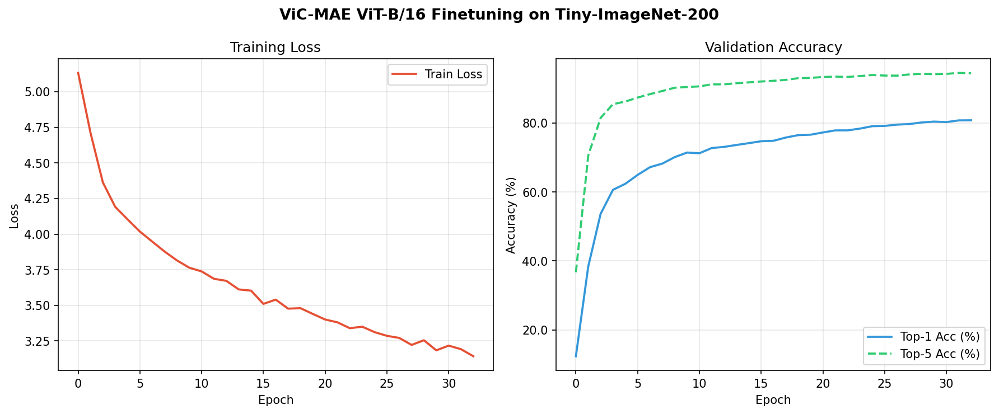

# ViC-MAE: Finetuning on Tiny-ImageNet-200

[](https://pytorch.org)
[](https://arxiv.org/abs/2010.11929)
[](https://arxiv.org/abs/2303.12001)
[](#results)
[](#results)

A complete reproduction and adaptation of the finetuning pipeline from **ViC-MAE: Self-Supervised Representation Learning from Images and Video with Contrastive Masked Autoencoders** (ECCV 2024).

This repository adapts a pretrained Vision Transformer (`ViT-Base/16`, 85.95M parameters) originally pretrained on ImageNet-1K + Kinetics-400, and finetunes it for 200-class fine-grained image classification on the **Tiny-ImageNet-200** benchmark.

---

## 📌 Key Highlights & Results

- **80.77% Top-1 Accuracy** and **94.39% Top-5 Accuracy** on Tiny-ImageNet validation split.
- **Fast transfer learning convergence:** Climbed from 12.39% to >60% accuracy within the first 3 epochs.
- **Interactive Darkroom Web UI (`demo.py`):** Standalone web application with a photo-lab visual theme to upload any image, visualize top-5 class predictions, and inspect exposure-style confidence readouts in real-time.
- **Dual execution paths:** Preconfigured for both high-memory cloud training (Kaggle dual-T4) and constrained local GPUs (RTX 3050 4GB with gradient accumulation).

### Performance Summary

| Metric | Result |
| :--- | :--- |
| **Model Architecture** | Vision Transformer (`vit_base_patch16`, 16×16 patch size) |
| **Parameters** | 85.95 Million |
| **Target Dataset** | Tiny-ImageNet-200 (100,000 train / 10,000 validation images) |
| **Input Resolution** | 224 × 224 (bicubic interpolation & crop) |
| **Finetuned Epochs** | 33 epochs (Cosine LR schedule with 5-epoch warmup) |
| **Effective Batch Size** | 128 |
| **Best Top-1 Accuracy** | **80.77%** |
| **Best Top-5 Accuracy** | **94.39%** |
| **Final Validation Loss** | 0.839 |

---

## 📈 Training & Validation Curves

The model was finetuned with AdamW, layer-wise learning rate decay (0.75), Mixup (0.8), CutMix (1.0), and label smoothing (0.1).



*Validation accuracy rises smoothly while validation loss steadily drops from 4.20 to 0.84 with no divergence or overfitting.*

---

## 🔬 Interactive Web Demo (`demo.py`)

A local web application built with Flask and PyTorch to test the finetuned model on any custom image.

- **Darkroom / Photo-Lab Aesthetic:** Safelight red (`#C1443B`) accents, warm charcoal canvas (`#17140F`), negative crop-marks, and monospace meter readings.
- **Instant Inference:** Runs image through BICUBIC upsampling + center crop, evaluates on CUDA/CPU, and ranks predictions with animated exposure bars.
- **Interactive Controls:** Drag & drop replacement, quick file selection, and reset toggles.

### Running the Demo

```bash
# Ensure model checkpoint is located in output directory
python demo.py
```
Then open [http://127.0.0.1:5000](http://127.0.0.1:5000) in your browser.

---

## 🛠️ Technical Fixes & Engineering Overcomes

During reproduction, several issues in the upstream codebase and environment were identified and resolved:

1. **`timm` Library Breaking Changes:**
   * *Issue:* Overridden `VisionTransformer.forward_features()` in `models_vit.py` broke under `timm >= 1.0` due to added keyword argument `attn_mask`.
   * *Fix:* Pinned dependency strictly to `timm==0.4.12` to maintain API compatibility.
2. **Upstream Standalone Evaluation Bug:**
   * *Issue:* Running `image_finetune.py` with `--eval` crashed with `UnboundLocalError` because `epoch` was only defined inside the training loop.
   * *Fix:* Patched line 311 to set `epoch=0` in eval mode.
3. **Resolution & Patch Embedding Mismatch:**
   * *Issue:* Tiny-ImageNet images are 64×64 native, but `ViT-Base/16` patch projection requires 224×224 (14×14 patch grid). Passing `--input_size 64` triggers patch assertion failures.
   * *Fix:* Standardized `--input_size 224` and utilized `RandomResizedCropAndInterpolation` upscaling.
4. **VRAM Optimization for Consumer Hardware:**
   * *Issue:* Running batch size 64 exceeded 4 GB VRAM on mobile/desktop GPUs (RTX 3050), triggering Windows shared memory swapping.
   * *Fix:* Parameterized gradient accumulation (`--batch_size 16 --accum_iter 8`) to maintain the effective batch size of 128 while capping memory at 3.08 GB.

---

## 🚀 How to Reproduce

### Option A: Cloud Training on Kaggle (Recommended)

1. Clone or import `vicmae_finetune_tinyimagenet.ipynb` into a Kaggle Notebook.
2. Attach the [ViC-MAE pretrained checkpoint](https://huggingface.co/jeffhernandez1995/vicmae) as an input dataset.
3. Select **GPU T4 × 2** accelerator and enable Internet access.
4. Run the notebook top-to-bottom. Checkpoints and evaluation logs will be generated in `/kaggle/working/output`.

### Option B: Local Training

```bash
# 1. Clone repository
git clone https://github.com/naitikk31/ViC-MAE-TinyImageNet.git
cd ViC-MAE-TinyImageNet

# 2. Set up Python environment
conda create -n vicmae python=3.9 -y
conda activate vicmae
conda install pytorch torchvision pytorch-cuda=11.8 -c pytorch -c nvidia -y
pip install timm==0.4.12 matplotlib flask

# 3. Clone upstream ViC-MAE repository
git clone https://github.com/jeffhernandez1995/ViC-MAE ViC-MAE

# 4. Download and structure Tiny-ImageNet
python setup_tiny_imagenet.py

# 5. Download ViC-MAE checkpoint
# Download vicmae_pretrain_vit_base_in1k_k400.pth from official repository/HF

# 6. Launch finetuning
cd ViC-MAE
python image_finetune.py \
    --model vit_base_patch16 \
    --finetune ../vicmae_pretrain_vit_base_in1k_k400.pth \
    --data_path ../tiny-imagenet-200 \
    --nb_classes 200 \
    --epochs 40 \
    --batch_size 128 \
    --input_size 224 \
    --blr 1e-3 \
    --layer_decay 0.75 \
    --weight_decay 0.05 \
    --drop_path 0.1 \
    --mixup 0.8 \
    --cutmix 1.0 \
    --output_dir ../output
```

---

## 📂 Repository Layout

```
.
├── demo.py                             # Interactive Flask darkroom demo web app
├── vicmae_finetune_tinyimagenet.ipynb  # End-to-end self-contained Kaggle notebook
├── plot_results.py                     # Metric extraction & curve plotting script
├── setup_tiny_imagenet.py              # Automated download & ImageFolder reorganizer
├── smoke_test_checkpoint.py            # Checkpoint loader & tensor shape verification
├── output/
│   └── 20260918-044542-vit_base_patch16-224/
│       ├── log.txt                     # JSON lines containing raw training telemetry
│       ├── training_log.csv            # Tabular training/validation loss & accuracy
│       └── training_curves.png         # Loss and accuracy curve charts
├── .gitignore                          # Excludes checkpoints, raw datasets & private reports
└── README.md
```

---

## 📚 References

1. **ViC-MAE:** Hernandez, J., Villegas, R., & Ordonez, V. (2024). *ViC-MAE: Self-Supervised Representation Learning from Images and Video with Contrastive Masked Autoencoders.* European Conference on Computer Vision (ECCV 2024). [arXiv:2303.12001](https://arxiv.org/abs/2303.12001)
2. **Masked Autoencoders:** He, K., Chen, X., Xie, S., Li, Y., Dollár, P., & Girshick, R. (2022). *Masked Autoencoders Are Scalable Vision Learners.* IEEE/CVF CVPR 2022.
3. **Vision Transformer (ViT):** Dosovitskiy, A., et al. (2021). *An Image is Worth 16x16 Words: Transformers for Image Recognition at Scale.* ICLR 2021.
